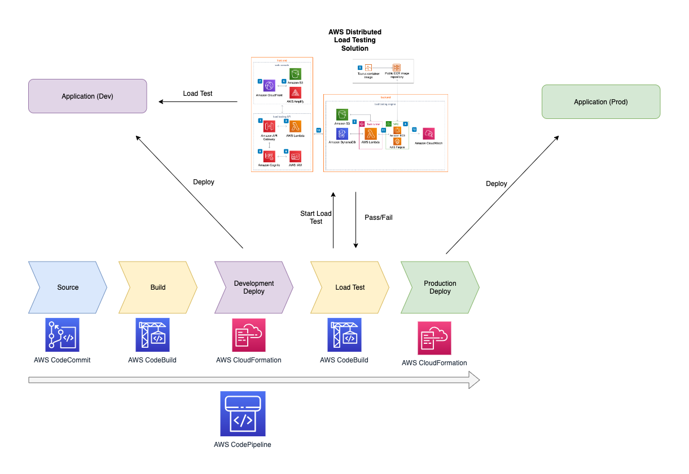

### Distributed Load Testing on AWS

#### Introduction

Distributed Load Testing on AWS(DLT) is a solution that allows you to perform load testing on your applications or systems hosted on Amazon Web Services (AWS) to evaluate the ability of a system, software, or application to manage demand. This is crucial to ensure that applications can scale and manage large numbers of users or concurrent requests.

For more details about the solution, access the [AWS Solution page](https://aws.amazon.com/solutions/distributed-load-testing-on-aws/).

#### Architecture

#### Prerequisites

1. An AWS account

#### Deployment

AWS provides a Cloudformation template to deploy the solution.

1. Log into your AWS account
2. Access the Cloudformation service and click on create stack
3. In the "Specify template" section, select Amazon S3 URL and paste the following content: https://s3.amazonaws.com/solutions-reference/distributed-load-testing-on-aws/latest/distributed-load-testing-on-aws.template
4. Click on Next
5. In the "Specify stack details" section, fill in the parameters according to your needs
6. Click on Next
7. In the "Configure stack options" section, click on Next
8. In the "Review" section, check the box "I acknowledge that AWS CloudFormation might create IAM resources with custom names."
9. Click on Create stack

After this, you'll receive an email with the login information to access the Load Testing platform.

#### Test options

The Load Testing platform provides two options to run tests:

1. Single URL: Allows you to run a test against a single URL
2. JMeter: Allows you to run a test using a JMeter script to allow more complex tests

This repo includes an example (**simple-http.jmx**) of a JMeter script that you can use to test the platform.

#### How to use the example?

1. Clone the repo
2. Edit the lines 32-42 according with your desired configuration - domain, port, protocol, path...
3. Upload edited JMX file via browser to the deployed AWS load testing platform
4. Run the test

#### How to automate the test by integrating it with your Github Actions pipeline?

The Load Testing platform provides an API that you can use to automate the test execution. The API is documented [here](https://docs.aws.amazon.com/solutions/latest/distributed-load-testing-on-aws/distributed-load-testing-api.html).

This repo includes an example (**payload.json**) of a payload that you can use to run a test using the API.

Follow down below a diagram that shows the flow of the pipeline including the test execution:

##### The next steps describe how to use the example

1. Clone the repo
2. Edit the (**payload.json**) file according with your desired configuration
3. Considering you already deployed Distributed Load Testing on AWS, go to the API gateway console and copy the DLTApi ID
3. Then click on the resource menu and copy the Resource ID for the /scenarios endpoint
5. Get the name of the S3 bucket created by the Cloudformation template. The name will start with the prefix distributedloadtesting-dlttestrunnerstoragedltsce-<id>
6. Based on the copied information from the API, edit the (**load-test.yml**) by changing RESOURCE_ID, REST_API_ID and S3_BUCKET values
7. Generate and add AWS access and secret keys to your Github repository secrets and name them AWS_ACCESS_KEY_ID and AWS_SECRET_ACCESS_KEY respectively
7. Incorporate the (**load-test.yml**) into your Github Actions pipeline

The (**load-test.yml**) is just an example of how you can integrate the test execution with your Github Actions pipeline. You can use it as a reference to create your own workflow.